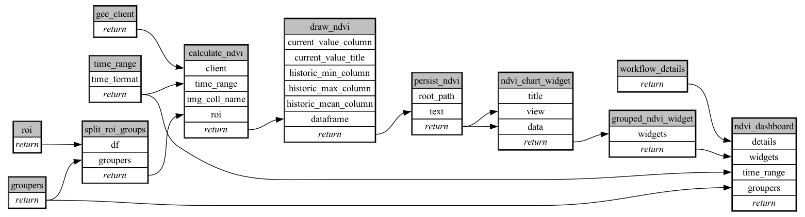

```
# AUTOGENERATED BY ECOSCOPE-WORKFLOWS; see fingerprint in README.md for details

```

```yaml
# fingerprint:
artifacts_sha256_basic: e90b8450f2471bb55d309585586b1d8296063a17d03435917df8bab3a8e796ff
artifacts_sha256_strict: 705c746747a3e5fc4e088ae7fb7de8b4af5e15650612fd218962b5248ccbdce0
installed_requirements:
- channel: https://repo.prefix.dev/ecoscope-workflows/
  name: ecoscope-workflows-core
  version: {version: ==0.3.7}
- channel: https://repo.prefix.dev/ecoscope-workflows/
  name: ecoscope-workflows-ext-ecoscope
  version: {version: ==0.3.7}
params_sha256: 3c520d00f05fcbee13d5135e56339d17cec936f78bdf11c9f28c15975a573af2
spec_sha256: 19ed99e05f03a016901608fef67d6178410412ae357db5981949e4bf0bd4c293

```

# ecoscope-workflows-ndvi-workflow


