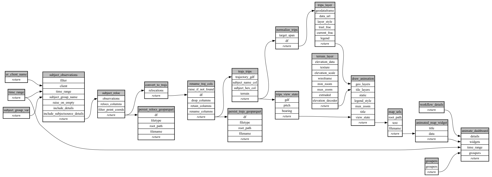

```
# AUTOGENERATED BY ECOSCOPE-WORKFLOWS; see fingerprint in README.md for details

```

```yaml
# fingerprint:
artifacts_sha256_basic: 39fddfd2cf867024f77c457fb84c94d854cc1cab70b77f64a5dda75af84690a7
artifacts_sha256_strict: 9fabf46c3dd21a6c7906e75c12fd3bdb722e8b7ec5e3514f37d3422b5320aaed
installed_requirements:
- channel: https://repo.prefix.dev/ecoscope-workflows/
  name: ecoscope-workflows-core
  version: {version: ==0.22.17}
- channel: https://repo.prefix.dev/ecoscope-workflows/
  name: ecoscope-workflows-ext-ecoscope
  version: {version: ==0.22.17}
- channel: conda-forge
  name: pydeck
  version: {version: ==0.9.2}
- channel: https://repo.prefix.dev/ecoscope-workflows-custom/
  name: ecoscope-workflows-ext-custom
  version: {version: ==0.0.57}
- channel: https://repo.prefix.dev/ecoscope-workflows-custom/
  name: ecoscope-workflows-ext-ste
  version: {version: ==0.0.22}
- channel: https://repo.prefix.dev/ecoscope-workflows-custom/
  name: ecoscope-workflows-ext-mnc
  version: {version: ==0.0.9}
- channel: https://repo.prefix.dev/ecoscope-workflows-custom/
  name: ecoscope-workflows-ext-big-life
  version: {version: ==0.0.11}
- channel: file:///tmp/ecoscope-workflows-custom/release/artifacts/
  name: ecoscope-workflows-ext-mep
  version: {version: ==0.0.21.dev0+g4ab422f7d.d20260623}
params_sha256: dfc6b10c283a899b893c5b08efd2aeb57eb2fdb3a3bb37726fb48997f6216dac
spec_sha256: 2760745e011b72686848f84ca7a6bd856774bbd72988cb67fa7533a300c21209

```

# ecoscope-workflows-animate-tracks-workflow


