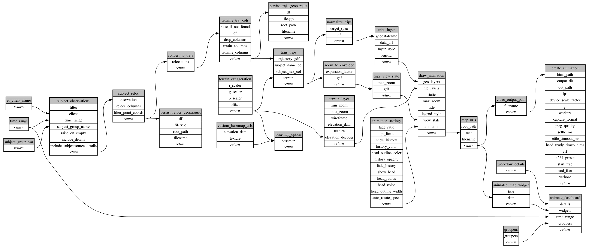

```
# AUTOGENERATED BY ECOSCOPE-WORKFLOWS; see fingerprint in README.md for details

```

```yaml
# fingerprint:
artifacts_sha256_basic: 32888e4d5a0d22bf6be9e7e86bda0aafe36008ae0553995d611c84f42c934a5b
artifacts_sha256_strict: cc6e552db3abb87dc5195734da04caae1ecbdc3c111adc14a030862db699ed0e
installed_requirements:
- channel: https://repo.prefix.dev/ecoscope-workflows/
  name: ecoscope-workflows-core
  version: {version: ==0.22.17}
- channel: https://repo.prefix.dev/ecoscope-workflows/
  name: ecoscope-workflows-ext-ecoscope
  version: {version: ==0.22.17}
- channel: conda-forge
  name: pydeck
  version: {version: ==0.9.2}
- channel: https://repo.prefix.dev/ecoscope-workflows-custom/
  name: ecoscope-workflows-ext-custom
  version: {version: ==0.0.57}
- channel: https://repo.prefix.dev/ecoscope-workflows-custom/
  name: ecoscope-workflows-ext-ste
  version: {version: ==0.0.22}
- channel: https://repo.prefix.dev/ecoscope-workflows-custom/
  name: ecoscope-workflows-ext-mnc
  version: {version: ==0.0.9}
- channel: https://repo.prefix.dev/ecoscope-workflows-custom/
  name: ecoscope-workflows-ext-big-life
  version: {version: ==0.0.11}
- channel: file:///tmp/ecoscope-workflows-custom/release/artifacts/
  name: ecoscope-workflows-ext-mep
  version: {version: ==0.0.29.dev0+g8d6dd4d48.d20260713}
params_sha256: 3d6b8eb7d45105f98de8219b843e2b06646854228457fbe2208af4bca0ea1ba7
spec_sha256: 4154eac2c8c0ec662ffc73f57554fd0414745e8fa5e27b8c4f4c5772886fb0a7

```

# ecoscope-workflows-animate-tracks-workflow


