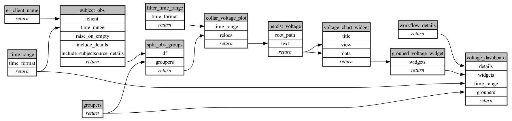

```
# AUTOGENERATED BY ECOSCOPE-WORKFLOWS; see fingerprint in README.md for details

```

```yaml
# fingerprint:
artifacts_sha256_basic: 5eff280d2ac2bfd9912e19d36e2fdb1dad27076249ade7f7bdf41eaa8b4bc565
artifacts_sha256_strict: 1da779b9c8b4a3a3ae770bb7553c11180f7e3d0792c5789b83bfc6ca3e9a91c2
installed_requirements:
- channel: https://repo.prefix.dev/ecoscope-workflows/
  name: ecoscope-workflows-core
  version: {version: ==0.7.2}
- channel: https://repo.prefix.dev/ecoscope-workflows/
  name: ecoscope-workflows-ext-ecoscope
  version: {version: ==0.7.2}
- channel: https://repo.prefix.dev/ecoscope-workflows-custom/
  name: ecoscope-workflows-ext-mep
  version: {version: ==0.0.2}
params_sha256: 2b0171c2ea257e0aeae4ab5347a59fcb9368ea5800c7a97566ba7cd3f520b844
spec_sha256: f7116afad18907f18f71a7735e70cead2cdcc13d757115554f4a28b9c920c678

```

# ecoscope-workflows-collar-voltage-workflow


