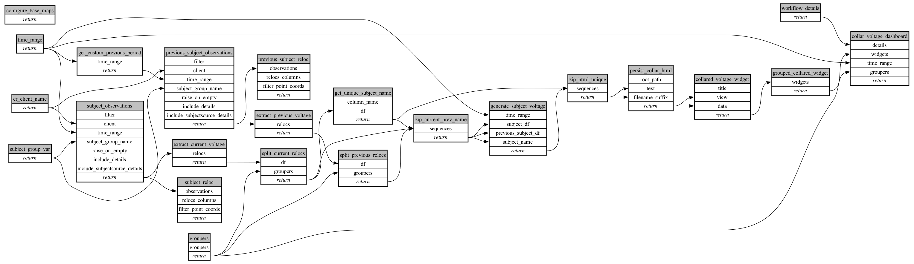

```
# AUTOGENERATED BY ECOSCOPE-WORKFLOWS; see fingerprint in README.md for details

```

```yaml
# fingerprint:
artifacts_sha256_basic: 7c0c76a2821e8669f553821f0093f8fe2c1ac4353a88e9af8a7bcf58b39237d0
artifacts_sha256_strict: 2f0f95c7c86ef1d6d8df22a8c653eea192c7378b15a54e336a0323827125855c
installed_requirements:
- channel: https://repo.prefix.dev/ecoscope-workflows/
  name: ecoscope-workflows-core
  version: {version: ==0.22.17}
- channel: https://repo.prefix.dev/ecoscope-workflows/
  name: ecoscope-workflows-ext-ecoscope
  version: {version: ==0.22.17}
- channel: https://repo.prefix.dev/ecoscope-workflows-custom/
  name: ecoscope-workflows-ext-custom
  version: {version: ==0.0.39}
- channel: https://repo.prefix.dev/ecoscope-workflows-custom/
  name: ecoscope-workflows-ext-ste
  version: {version: ==0.0.18}
- channel: https://repo.prefix.dev/ecoscope-workflows-custom/
  name: ecoscope-workflows-ext-mnc
  version: {version: ==0.0.7}
- channel: https://repo.prefix.dev/ecoscope-workflows-custom/
  name: ecoscope-workflows-ext-big-life
  version: {version: ==0.0.8}
- channel: file:///tmp/ecoscope-workflows-custom/release/artifacts/
  name: ecoscope-workflows-ext-mep
  version: {version: ==0.0.13.dev0+gfa96d6450.d20260413}
params_sha256: 72d960473dae1b0b9d09b8976e987d22ea60ae7a295e079969db69248d2f84fb
spec_sha256: c78ffa0d1d3f5bcc9a95e6d5aef381131301717c560505e0b216d27aa83137bd

```

# ecoscope-workflows-collar-voltage-report-workflow


