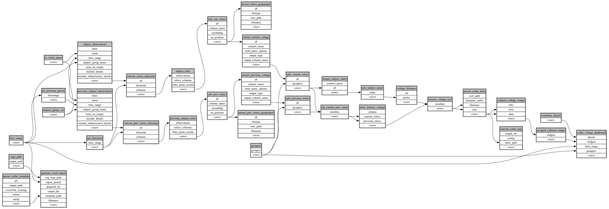

```
# AUTOGENERATED BY ECOSCOPE-WORKFLOWS; see fingerprint in README.md for details

```

```yaml
# fingerprint:
artifacts_sha256_basic: 98e94a969d90972cf63f424120717b89d29ce3c3abad1326a744badb4d06f479
artifacts_sha256_strict: fdd7cf895e7ad731b5254690a9a0f5d1eee776943470081def3e1a6922cf38a8
installed_requirements:
- channel: https://repo.prefix.dev/ecoscope-workflows/
  name: ecoscope-platform
  version: {version: ==2.15.1}
- channel: https://repo.prefix.dev/ecoscope-workflows-custom/
  name: ecoscope-workflows-ext-custom
  version: {version: ==0.1.0rc14}
- channel: https://repo.prefix.dev/ecoscope-workflows-custom/
  name: ecoscope-workflows-ext-ste
  version: {version: ==0.0.0rc1}
- channel: file:///tmp/ecoscope-workflows-custom/release/artifacts/
  name: ecoscope-workflows-ext-mep
  version: {version: ==1.0.1.dev0+gae11a9381.d20260828}
- channel: conda-forge
  name: pydeck
  version: {version: ==0.9.2}
- channel: conda-forge
  name: opentelemetry-sdk
  version: {version: ==1.44.0}
params_sha256: e6066dba76f3cf94aef4d4886aa0a1adfd26c84592e3fe28ecd3538f3d198fc3
spec_sha256: b2dec2cc5c2edd3d99b2d7a959f4f0854c34bbb5d2716f47ab3b9f85fd027072

```

# ecoscope-workflows-collar-voltage-report-workflow


