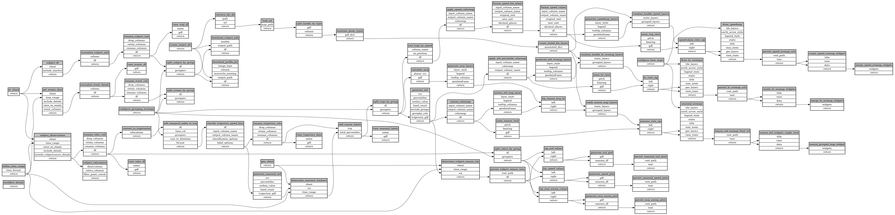

```
# AUTOGENERATED BY ECOSCOPE-WORKFLOWS; see fingerprint in README.md for details

```

```yaml
# fingerprint:
artifacts_sha256_basic: cf3c994c2b4806e1806fb993b7d4ca9faadda74b281c3d90e8e695950f932dbf
artifacts_sha256_strict: d2cd2627fcfac05e06dd759e4313c1df4b627bdc7a1dcf2559bb6e7634aeb419
installed_requirements:
- channel: https://repo.prefix.dev/ecoscope-workflows/
  name: ecoscope-workflows-core
  version: {version: ==0.7.8}
- channel: https://repo.prefix.dev/ecoscope-workflows/
  name: ecoscope-workflows-ext-ecoscope
  version: {version: ==0.7.8}
- channel: file:///tmp/ecoscope-workflows-custom/release/artifacts/
  name: ecoscope-workflows-ext-mep
  version: {version: ==10000.dev24+gdbf13aad.d20250915}
params_sha256: b34163073cfba84a3473e4fb72568f96b65ba776d4cbcf244be02ea9ae456f3a
spec_sha256: 35f8fe4240e52dc2b74827f64b801aa1d24b5c61a04f4bd9717e59fcd7cf049c

```

# ecoscope-workflows-collared-elephant-report-workflow


