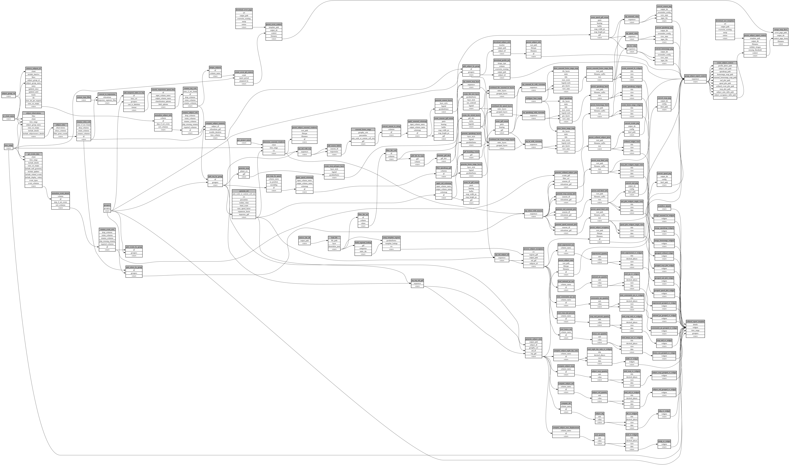

```
# AUTOGENERATED BY ECOSCOPE-WORKFLOWS; see fingerprint in README.md for details

```

```yaml
# fingerprint:
artifacts_sha256_basic: 2b875293463dc27566e49814e29a76acfc3a614f3e74e8616ff3195ec2de0d34
artifacts_sha256_strict: 7f64b436c3eb76e102ed8da47ace08d26f90910783c7237fd1b5af21259bc42c
installed_requirements:
- channel: https://repo.prefix.dev/ecoscope-workflows/
  name: ecoscope-workflows-core
  version: {version: ==0.20.4}
- channel: https://repo.prefix.dev/ecoscope-workflows/
  name: ecoscope-workflows-ext-ecoscope
  version: {version: ==0.20.4}
- channel: https://repo.prefix.dev/ecoscope-workflows-custom/
  name: ecoscope-workflows-ext-custom
  version: {version: ==0.0.20}
- channel: https://repo.prefix.dev/ecoscope-workflows-custom/
  name: ecoscope-workflows-ext-ste
  version: {version: ==0.0.6}
- channel: https://repo.prefix.dev/ecoscope-workflows-custom/
  name: ecoscope-workflows-ext-mnc
  version: {version: ==0.0.2}
- channel: file:///tmp/ecoscope-workflows-custom/release/artifacts/
  name: ecoscope-workflows-ext-mep
  version: {version: ==10000.dev19+gd86a3a6e4.d20260127}
params_sha256: 5ffe1a6b41b0bc59a3e47180e1ef164e01d48ee9df7e539220074a3837a1cdd9
spec_sha256: a0bcbff46f0506acaebfe06fc2ac6e77f74c9376392a9f9b85483a7480963d55

```

# ecoscope-workflows-mep-collared-report-workflow


