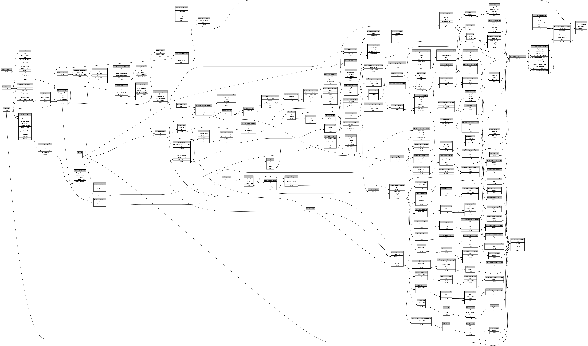

```
# AUTOGENERATED BY ECOSCOPE-WORKFLOWS; see fingerprint in README.md for details

```

```yaml
# fingerprint:
artifacts_sha256_basic: 93a44e1a72ef488aff2c988f4bbfc097d1d47161482ffcf7dfe84755b8a76570
artifacts_sha256_strict: 0502d93fefb40c9ebd7d8b703452737d8ab69fe9b29d7da34379893770dc5372
installed_requirements:
- channel: https://repo.prefix.dev/ecoscope-workflows/
  name: ecoscope-workflows-core
  version: {version: ==0.22.17}
- channel: https://repo.prefix.dev/ecoscope-workflows/
  name: ecoscope-workflows-ext-ecoscope
  version: {version: ==0.22.17}
- channel: https://repo.prefix.dev/ecoscope-workflows-custom/
  name: ecoscope-workflows-ext-custom
  version: {version: ==0.0.39}
- channel: https://repo.prefix.dev/ecoscope-workflows-custom/
  name: ecoscope-workflows-ext-ste
  version: {version: ==0.0.18}
- channel: https://repo.prefix.dev/ecoscope-workflows-custom/
  name: ecoscope-workflows-ext-mnc
  version: {version: ==0.0.7}
- channel: https://repo.prefix.dev/ecoscope-workflows-custom/
  name: ecoscope-workflows-ext-big-life
  version: {version: ==0.0.8}
- channel: file:///tmp/ecoscope-workflows-custom/release/artifacts/
  name: ecoscope-workflows-ext-mep
  version: {version: ==0.12.1.dev3+g6436b75dc}
params_sha256: f911408ed16a7d281a721f6440ab1d8fd0347738a570da12ad1bf9c5a0f5d23e
spec_sha256: d6c55ab251196f69972d9b61524b2f245fd378d4ce42892fa58fa2812c67e6ae

```

# ecoscope-workflows-mep-collared-report-workflow


