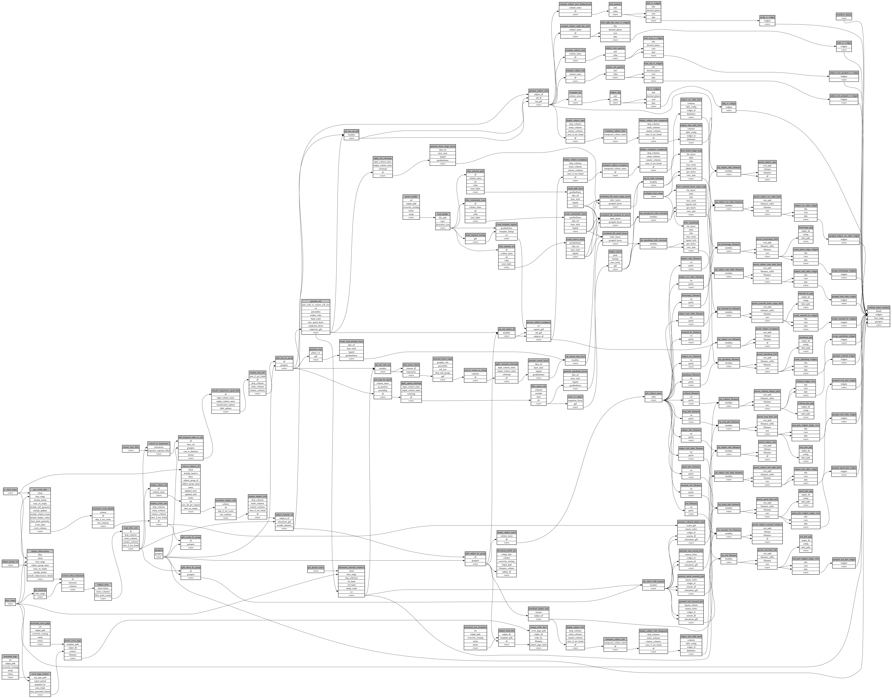

```
# AUTOGENERATED BY ECOSCOPE-WORKFLOWS; see fingerprint in README.md for details

```

```yaml
# fingerprint:
artifacts_sha256_basic: 1336c39c85550e35b1e631fd7e01baf3451438f95ccb06659a3e45f51103c639
artifacts_sha256_strict: ec5838a7a96a13bf8abe908d7afc08de15f58d0cfc70edc3f697c2ce7520ee5b
installed_requirements:
- channel: https://repo.prefix.dev/ecoscope-workflows/
  name: ecoscope-platform
  version: {version: ==2.15.1}
- channel: https://repo.prefix.dev/ecoscope-workflows-custom/
  name: ecoscope-workflows-ext-custom
  version: {version: ==0.1.0rc14}
- channel: https://repo.prefix.dev/ecoscope-workflows-custom/
  name: ecoscope-workflows-ext-ste
  version: {version: ==0.0.0rc1}
- channel: file:///tmp/ecoscope-workflows-custom/release/artifacts/
  name: ecoscope-workflows-ext-mep
  version: {version: ==0.0.30.dev1+gadfe5fd93.d20260827}
- channel: conda-forge
  name: pydeck
  version: {version: ==0.9.2}
- channel: conda-forge
  name: opentelemetry-sdk
  version: {version: ==1.44.0}
params_sha256: cc0bf1b8244dcf50c9cd2adc9f93b9c86ba4a13f0308d6dc7d3ecc2e3d219189
spec_sha256: 0959433f0e5396f9ffc87fd8f61979df90eb5f98edee35500a75ecf1c70fb8f4

```

# ecoscope-workflows-mep-collared-report-workflow


