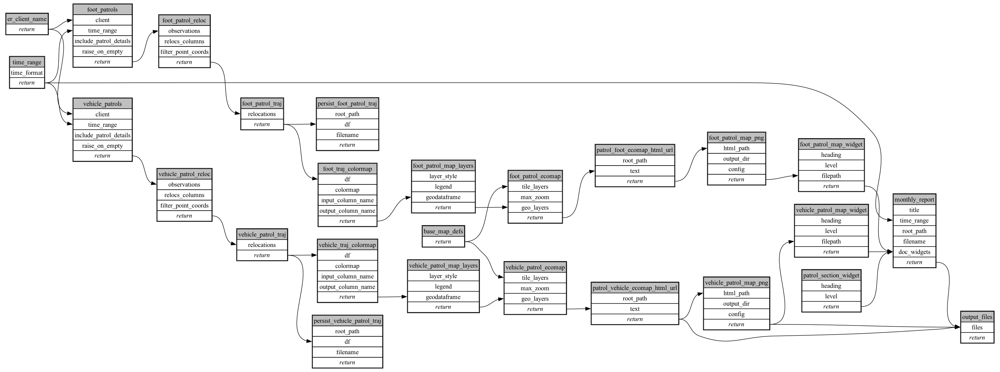

```
# AUTOGENERATED BY ECOSCOPE-WORKFLOWS; see fingerprint in README.md for details

```

```yaml
# fingerprint:
artifacts_sha256_basic: 501d342a53d81d7e911ee02ec7048d4e29fae75ecab189fded15a65f027edbdc
artifacts_sha256_strict: 28dac879db712ce34795b750e6a61e699e792d97cccaf4b3741ebe45f0f0afc8
installed_requirements:
- channel: https://repo.prefix.dev/ecoscope-workflows/
  name: ecoscope-workflows-core
  version: {version: ==0.7.2}
- channel: https://repo.prefix.dev/ecoscope-workflows/
  name: ecoscope-workflows-ext-ecoscope
  version: {version: ==0.7.2}
- channel: https://repo.prefix.dev/ecoscope-workflows-custom/
  name: ecoscope-workflows-ext-mep
  version: {version: ==0.0.2}
- channel: https://repo.prefix.dev/ecoscope-workflows-custom/
  name: ecoscope-workflows-ext-custom
  version: {version: ==0.0.3}
params_sha256: fe51d94fddd7b25efbae17ad2599d2a8c5680166bdc2cf5172ba4ff4a908730a
spec_sha256: 72adb39cbc133bf160c9f779decb4c2efa5f0c0f7d2da9e73916585f9178ca7b

```

# ecoscope-workflows-mep-monthly-report-workflow


