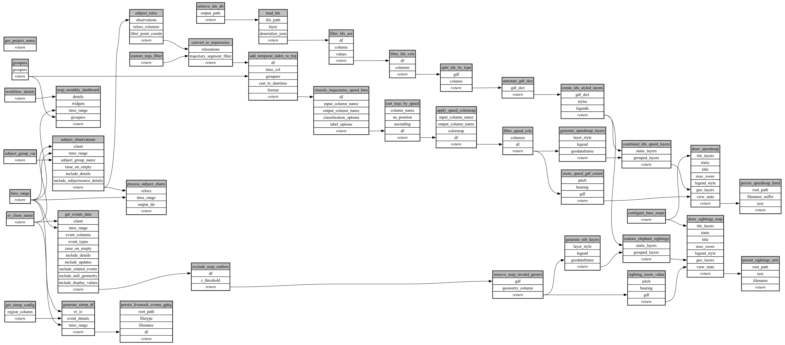

```
# AUTOGENERATED BY ECOSCOPE-WORKFLOWS; see fingerprint in README.md for details

```

```yaml
# fingerprint:
artifacts_sha256_basic: 0b8e7392fead04d1f2a0c8085ccde92ddaaaa9322c7e759b1870f9a726c0b1f2
artifacts_sha256_strict: d5c04cb13c5db306fd6868d009f5012d5ca2dd3fcb5c79ad3d2e7d4b0ad825a8
installed_requirements:
- channel: https://repo.prefix.dev/ecoscope-workflows/
  name: ecoscope-workflows-core
  version: {version: ==0.20.6}
- channel: https://repo.prefix.dev/ecoscope-workflows/
  name: ecoscope-workflows-ext-ecoscope
  version: {version: ==0.20.6}
- channel: https://repo.prefix.dev/ecoscope-workflows-custom/
  name: ecoscope-workflows-ext-custom
  version: {version: ==0.0.23}
- channel: https://repo.prefix.dev/ecoscope-workflows-custom/
  name: ecoscope-workflows-ext-ste
  version: {version: ==0.0.8}
- channel: https://repo.prefix.dev/ecoscope-workflows-custom/
  name: ecoscope-workflows-ext-mnc
  version: {version: ==0.0.2}
- channel: file:///tmp/ecoscope-workflows-custom/release/artifacts/
  name: ecoscope-workflows-ext-mep
  version: {version: ==0.0.5.dev2+gbb596ca0b.d20260206}
params_sha256: 429d813fa3d6022d64c66989e6a4f80348f133139f5272e01f62106afda0166f
spec_sha256: 5835ed701ab3113e8a97aafaa99af3323fbbecde9f5a31b293340ce7f5452ef3

```

# ecoscope-workflows-mep-collared-report-workflow


