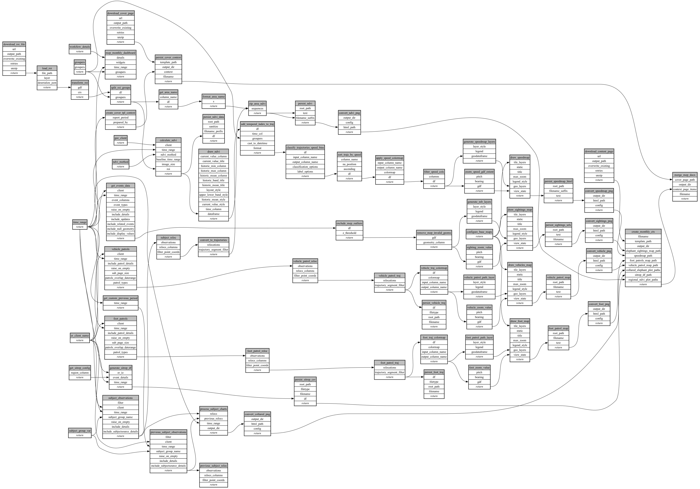

```
# AUTOGENERATED BY ECOSCOPE-WORKFLOWS; see fingerprint in README.md for details

```

```yaml
# fingerprint:
artifacts_sha256_basic: 2fc3cb92c0f91c451534c2e2cdd4a57eee864c8262e402d681808010f1dcf627
artifacts_sha256_strict: 6d7bc56951310736bcc1c8dc3794b2bd02c46cc4cfa02ad5d32a1e726168df94
installed_requirements:
- channel: https://repo.prefix.dev/ecoscope-workflows/
  name: ecoscope-workflows-core
  version: {version: ==0.22.17}
- channel: https://repo.prefix.dev/ecoscope-workflows/
  name: ecoscope-workflows-ext-ecoscope
  version: {version: ==0.22.17}
- channel: https://repo.prefix.dev/ecoscope-workflows-custom/
  name: ecoscope-workflows-ext-custom
  version: {version: ==0.0.39}
- channel: https://repo.prefix.dev/ecoscope-workflows-custom/
  name: ecoscope-workflows-ext-ste
  version: {version: ==0.0.18}
- channel: https://repo.prefix.dev/ecoscope-workflows-custom/
  name: ecoscope-workflows-ext-mnc
  version: {version: ==0.0.7}
- channel: https://repo.prefix.dev/ecoscope-workflows-custom/
  name: ecoscope-workflows-ext-big-life
  version: {version: ==0.0.8}
- channel: file:///tmp/ecoscope-workflows-custom/release/artifacts/
  name: ecoscope-workflows-ext-mep
  version: {version: ==0.12.1.dev4+g4b58d1.d20260325}
params_sha256: e3fa1e124a2475e5ce37b577826e94935c484b462b26a20117e73d62e0ae4439
spec_sha256: 7d3d0a7aea695ec38b85d69b749080c3e62ac444c8201e8f7606df23f3285ba4

```

# ecoscope-workflows-mep-monthly-report-workflow


