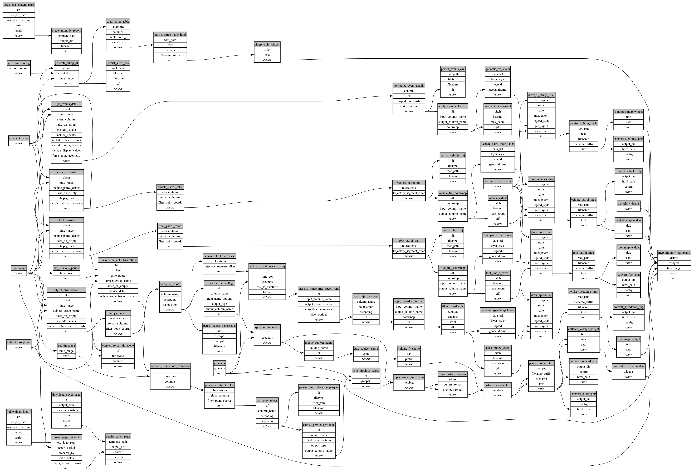

```
# AUTOGENERATED BY ECOSCOPE-WORKFLOWS; see fingerprint in README.md for details

```

```yaml
# fingerprint:
artifacts_sha256_basic: 3a171fae678e9b55d9d72c82826f6c1a26825a9968b2cd7083c38c1f4f25a0fe
artifacts_sha256_strict: dabf68a26ba1e13397df7c256f13d13a7ef44675a3d4c69b9cf9c282bf37b031
installed_requirements:
- channel: https://repo.prefix.dev/ecoscope-workflows/
  name: ecoscope-platform
  version: {version: ==2.15.1}
- channel: https://repo.prefix.dev/ecoscope-workflows-custom/
  name: ecoscope-workflows-ext-custom
  version: {version: ==0.1.0rc14}
- channel: https://repo.prefix.dev/ecoscope-workflows-custom/
  name: ecoscope-workflows-ext-ste
  version: {version: ==0.0.0rc1}
- channel: file:///tmp/ecoscope-workflows-custom/release/artifacts/
  name: ecoscope-workflows-ext-mep
  version: {version: ==1.0.1.dev2+g0ebf264b7.d20260831}
- channel: conda-forge
  name: pydeck
  version: {version: ==0.9.2}
- channel: conda-forge
  name: opentelemetry-sdk
  version: {version: ==1.44.0}
params_sha256: 7a734aa43309e4335e1aadc6159a1bcc8963de0ada4a6c47ada22047afb26148
spec_sha256: 1545b49d6be8ffc25556a46749a96804c22e7a2bff2e2f7efac4f1c611fe3e63

```

# ecoscope-workflows-mep-monthly-report-workflow


