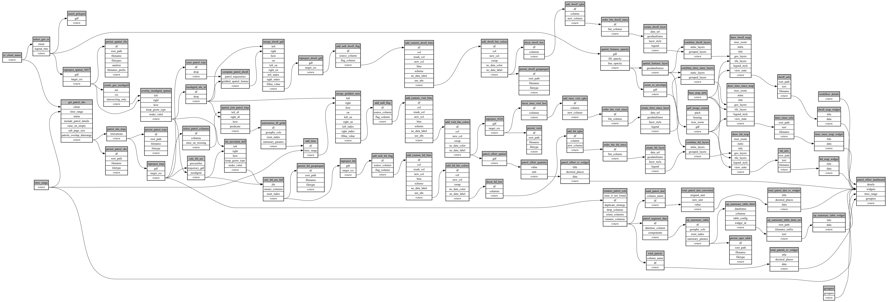

```
# AUTOGENERATED BY ECOSCOPE-WORKFLOWS; see fingerprint in README.md for details

```

```yaml
# fingerprint:
artifacts_sha256_basic: c29261eab16695087f02e736bdbffed208d23e011c7d9f12004fd53258bd3b88
artifacts_sha256_strict: 3302038400bc34f2adb3a0515ec5b2c72ed539f982ef8a6606277f3438aee8e0
installed_requirements:
- channel: https://repo.prefix.dev/ecoscope-workflows/
  name: ecoscope-platform
  version: {version: ==2.22.0}
- channel: https://repo.prefix.dev/ecoscope-workflows-custom/
  name: ecoscope-workflows-ext-custom
  version: {version: ==0.1.0rc14}
- channel: https://repo.prefix.dev/ecoscope-workflows-custom/
  name: ecoscope-workflows-ext-ste
  version: {version: ==0.0.0rc1}
- channel: file:///tmp/ecoscope-workflows-custom/release/artifacts/
  name: ecoscope-workflows-ext-mep
  version: {version: ==1.0.3.dev3+gdc8b31454.d20260910}
- channel: conda-forge
  name: pydeck
  version: {version: ==0.9.2}
- channel: conda-forge
  name: opentelemetry-sdk
  version: {version: ==1.44.0}
params_sha256: ed74d16d4e7e82e43aed2cd73f8f3196fb555e9024b888492deaa8275a52b893
spec_sha256: 2694b95098d233f2c2e9676e1d35a8e0d9ff32d844311cadb317b8bf61cbdc12

```

# ecoscope-workflows-patrol-field-effort-workflow


