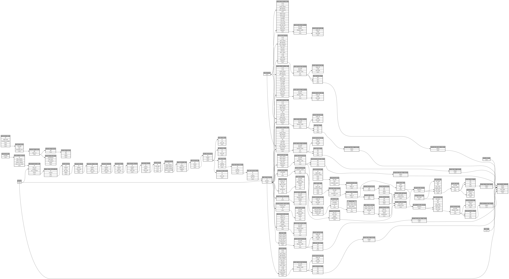

```
# AUTOGENERATED BY ECOSCOPE-WORKFLOWS; see fingerprint in README.md for details

```

```yaml
# fingerprint:
artifacts_sha256_basic: f585ef5a91877870e9fc1f05b5638049a346230afdb48003da37952b1c8d839d
artifacts_sha256_strict: fdc87dbfc53c39d59441270b5e833718118a7e644486db12bde003e564f04b2b
installed_requirements:
- channel: https://repo.prefix.dev/ecoscope-workflows/
  name: ecoscope-workflows-core
  version: {version: ==0.22.17}
- channel: https://repo.prefix.dev/ecoscope-workflows/
  name: ecoscope-workflows-ext-ecoscope
  version: {version: ==0.22.17}
- channel: https://repo.prefix.dev/ecoscope-workflows-custom/
  name: ecoscope-workflows-ext-custom
  version: {version: ==0.0.46}
- channel: https://repo.prefix.dev/ecoscope-workflows-custom/
  name: ecoscope-workflows-ext-ste
  version: {version: ==0.0.20}
- channel: https://repo.prefix.dev/ecoscope-workflows-custom/
  name: ecoscope-workflows-ext-mnc
  version: {version: ==0.0.9}
- channel: https://repo.prefix.dev/ecoscope-workflows-custom/
  name: ecoscope-workflows-ext-big-life
  version: {version: ==0.0.11}
- channel: file:///tmp/ecoscope-workflows-custom/release/artifacts/
  name: ecoscope-workflows-ext-mep
  version: {version: ==0.0.18.dev1+g7ba59688b.d20260421}
params_sha256: df6fa68a74f108bc731ed3df35bc412a52fbf032b8dcf8f946338523f4faf170
spec_sha256: 9ba82d971e29d528d9376fdd12935b363ca8503d2a76aefc3bbd7e156e6558fd

```

# ecoscope-workflows-predation-report-workflow


