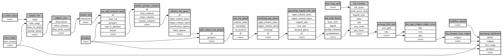

```
# AUTOGENERATED BY ECOSCOPE-WORKFLOWS; see fingerprint in README.md for details

```

```yaml
# fingerprint:
artifacts_sha256_basic: 41e4ea757e85fc86534261f42bd1053c0e5200c0a9f7d87b0ffd54159755d4b2
artifacts_sha256_strict: b7d79f1d2253922e969a4d5508eae567b4cb3388f8085bc962330c9abb596d4a
installed_requirements:
- channel: https://repo.prefix.dev/ecoscope-workflows/
  name: ecoscope-workflows-core
  version: {version: ==0.3.1}
- channel: https://repo.prefix.dev/ecoscope-workflows/
  name: ecoscope-workflows-ext-ecoscope
  version: {version: ==0.3.1}
params_sha256: 885fd7c6a4542dc364c4804875f17817835fe2277109118ce19a5967f23ebdc4
spec_sha256: 13482e2094200d2246e9accf05aac027aa0db299193555dab0b71faeb7848b92

```

# ecoscope-workflows-speedmap-workflow


